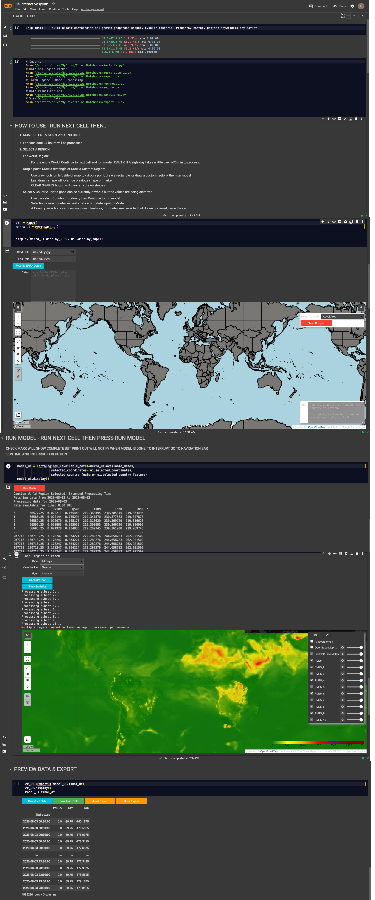

# USRA-STI
Providing a Keras CNN machine learning approach to estimate P.M. 2.5 levels, utilizing Google Earth Engine's MERRA-2 Data

A web app version can be found on: 

# TOC
- [Understanding the Repository Contents](#understanding-the-repository-contents)
- [Using the Jupyter Notebook Locally](#using-the-jupyter-notebook-locally)
- [Using the Jupyter Notebook with Google Colab](#using-the-jupyter-notebook-with-google-colab)
- [Notes](#notes)

# Understanding the Repository Contents:

The repository contains a Jupyter Notebook and other required files for a specific project or analysis.
Look for files with the .ipynb extension – these are Jupyter Notebook files.
Other files might include datasets, Python scripts, or documentation necessary for the Jupyter Notebook.

# Using the Jupyter Notebook Locally
1. Clone the Repository:
Clone the repository to your local machine using Git. In your terminal or command prompt, run:
`git clone https://github.com/romero61/USRA-STI.git`
This will create a copy of the repository on your computer.

2. Install Required Dependencies:
Navigate to the cloned repository directory.
If there is a requirements.txt file, you can install the required Python packages using pip:
`pip install -r requirements.txt`

3. Open the Jupyter Notebook:
If you have Jupyter installed, you can launch it by typing `jupyter notebook` in your terminal or command prompt.
Navigate to the notebook file (`.ipynb`) within the Jupyter interface and open it.

# Using the Jupyter Notebook with Google Colab
1. Open Google Colab:
Go to [Google Colab](https://colab.research.google.com/).

2. Import the Notebook:
In Colab, choose 'File' > 'Open notebook'.
Select the 'GitHub' tab.
Enter the repository URL (https://github.com/romero61/USRA-STI) and search.
Click on the notebook file from the search results to open it in Colab.

3. Install Any Required Packages:
If the notebook requires specific Python packages not available in Colab by default, you can install them directly in a notebook cell using `!pip install package-name`.

4. Run the Notebook:
You can now run the notebook cells one by one.
If the notebook uses external files (like datasets), you might need to upload them to Colab or modify the notebook to read them from a cloud storage like Google Drive.

# Notes:
Jupyter Notebooks: These are interactive documents containing live code, equations, visualizations, and narrative text. They are widely used for data cleaning and transformation, numerical simulation, statistical modeling, data visualization, machine learning, and much more.
Local vs. Colab: Running the notebook locally requires setting up a Python environment and Jupyter Notebook on your machine. Google Colab, on the other hand, provides a ready-to-use environment with most common libraries pre-installed and offers free access to GPUs and TPUs for computation.
GitHub Repository: The repository is a source for all the necessary files and often includes instructions or documentation on how to use them. Always check for a README.md file for specific instructions related to the repository.

# References
[pending
](https://disc.gsfc.nasa.gov/information/mission-project?title=HAQAST:%20Global%20Daily%20PM2.5)
For assistance please feel free to reach out: [Guillermo Romero](https://github.com/romero61)

#
License
This project is licensed under the MIT License - see the LICENSE.md file for details
